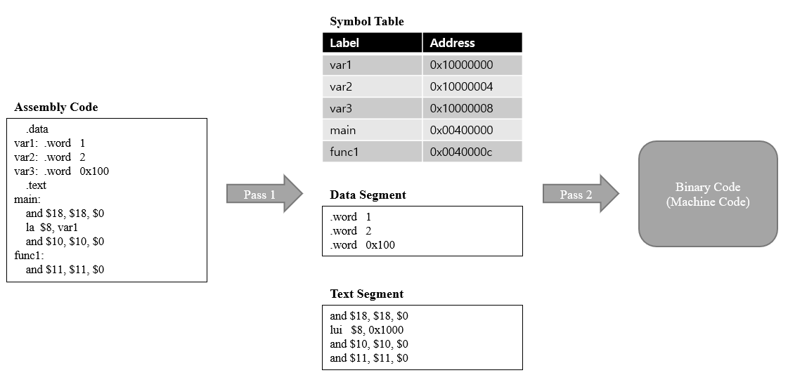

# Project 1. MIPS Assembler
  첫번째, 컴퓨터 구조 과제는 MIPS Assemlbler를 설계하는 과제였다. 
 sampleinput 폴더에 있는 Assembly Code를 파싱해와서 MIPS CODE에 맞는 binary code 로 변환하면 되는 과제였다. 
  이 과제를 수행하기 위해서는 두가지 방법이 있었다. 
 먼저, DATA Table과 Text Table을 링크드리스트의 자료구조 형태로 만들어서 각 포멧에 맞는 binary code로 변환하는 것이다. 
두번째, 방법은 교수님이 주신 skeleton code 처럼 tepfile() 함수를 이용해, 임시의 file을 만들어 DATA와 Text Talbe을 만들어 활용 하는 방법이다. 

## Introductions

 테이블의 구조이다. 위의 사진처럼 tepfile()을 이용하여 Data Table은 데이터 테이블 file에, Text Table file에 저장하는 방법을 이용 했다. 
 이 때, Data Table의 시작 주소는 0X1000000  이였고 Text Table의 시작 주소는 0x0040000 이다.
 위와 같이 text 구조와 data 구조를 서로 떨어트려 저장하는 이유는 MIPS 구조의 컨셉이라고 하셨는데, 정확한 이유는 잘모르겠다.
 어쨋든, Data table의 시작 주소와 Text table의 시작 주소를 잘 고려하여, file을 만들어주고
 2-pass 과정에서 MIPS의 포멧에 맞게 binary code를 만들어주면 된다.

## Funtion Desciption

1. __void make_symbol_table(FILE *input)__  
       Data table 을 생성하는 함수이다.
2. __void make_binary_file(FILE *output)__  
       Text table 을 생성하는 함수이다.
3. __void record_text_section(FILE *output)__  
       생성한 Text Table을 참고하여 각 inst에 맞는 binary code를 만드는 함수이다.
4. __void record_data_section(FILE *output)__  
       생성한 Data Table을 참고하여 각 inst에 맞는 binary code를 만드는 함수이다.

## review
 7번째, sample만 strtok(" ")으로 토큰이 생성되지 않아서 따로 예외처리를 해줬다. 
아마 sample 생성과정에서 뭔가 다르게 공백을 처리한거 같다. 
어쨋든, 이번 과제로 인해 하이 랭귀지에서 로우 랭귀지로 번역되는 과정을 재대로 이해할수 있었다. 
우리가 작성한 c코드는 전처리기->컴파일러->어셈블러->링킹->로더 과정을 거쳐서 컴퓨터가 수행할수 있는 binary code로 변환된다는 것을 알았고 
각 과정에 따라 어떻게하면 좀더 효율적으로 코드를 작성할수 있을지 알수 있어서 좋았다. 
예를 들어 재귀함수를 사용하는 경우 돌아갈 주소와 변수들을 stack pointer를 이용하여 메모리에 저장해야 하기 때문에 
cost가 높았다는 것을 어셈블리어를 직접 작성하면서 알수 있었다. 
또한, 같은 동작을 하는 코드라도 어떻게 하이 랭귀지를 작성하냐에 따라 만들어지는 inst의 갯수가 달라져 속도의 차이가 날 수 있다는 것을 알았다. 
